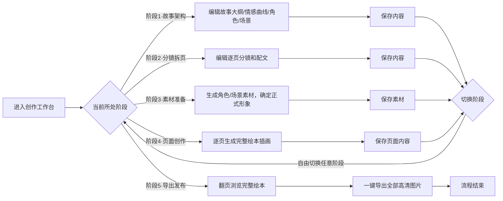

# AI绘本工作室 - 创作工作台 PRD v1.0

## 一、文档信息
| 项 | 内容 |
|----|------|
| 版本 | v1.0 |
| 最后更新 | 2026-05-24 |
| 状态 | 已确认 |
| 文档所有者 | 产品团队 |

## 二、产品概述
创作工作台是AI绘本工作室的核心功能模块，采用5阶段线性工作流，引导用户从故事构思到最终导出完整绘本，全程支持AI辅助创作，保证角色形象统一、风格一致。

## 三、核心用户流程


## 四、全局交互规范
### 4.1 页面结构统一规范
所有阶段页面采用统一的三层结构：
1. **顶部操作栏**：固定展示Logo、项目设置、用户头像菜单，无保存按钮（内容实时自动保存）
2. **步骤导航栏**：5个阶段横向排列，当前阶段高亮显示，已完成阶段打勾标识
3. **全局操作栏**：步骤导航下方，放置当前阶段的全局操作按钮（重新生成、下一步、导出等）
4. **内容区**：左右两栏布局
   - 左侧：导航列表（阶段对应子菜单/页面列表/素材列表）
   - 右侧：内容编辑/预览区，支持上下滚动

### 4.2 通用交互规则
- **实时保存**：所有内容修改实时自动保存，无需用户手动点击保存
- **阶段切换**：用户可自由切换任意已解锁阶段，切换时自动保存当前阶段内容
- **生成逻辑**：AI生成类操作默认选中最新生成结果，支持查看历史记录切换
- **状态标识**：所有可操作项都有明确的状态提示（生成中、已完成、待复查等）

---

## 五、阶段详细需求

### 阶段1：故事架构
#### 页面结构
```
┌──────────────────────────────────────────────────────────────────────────────────────┐
│ 📚 绘本创作工作台                                                [项目设置] [用户头像▼] │ ← 顶部操作栏
├──────────────────────────────────────────────────────────────────────────────────────┤
│ ● 阶段1·故事架构 │ ○ 阶段2·分镜拆页 │ ○ 阶段3·素材准备 │ ○ 阶段4·页面创作 │ ○ 阶段5·导出发布 │ ← 步骤菜单
├──────────────────────────────────────────────────────────────────────────────────────┤
│                                                   🪄 重新生成故事架构 | 🚀 下一步（进入分镜拆页） │ ← 全局操作栏
├───────────────────┬──────────────────────────────────────────────────────────────────┤
│                   │                                                                  │
│  📂 左侧菜单区     │  📝 右侧内容编辑区（支持上下滚动）                                 │
│                   │                                                                  │
│  ▶ 故事架构        │  ┌────────────────────────────────────────────────────────────┐  │
│  ▶ 故事大纲        │  │ 故事大纲内容编辑框                                            │
│  ▶ 情感曲线        │  │ （多行输入，支持富文本编辑）                                    │
│  ▶ 角色            │  │ 小松鼠多多住在森林里，喜欢探险...                              │
│  ▶ 场景            │  └────────────────────────────────────────────────────────────┘  │
│                   │                                                                  │
│                   │  ┌────────────────────────────────────────────────────────────┐  │
│                   │  │ 🪄 重新生成 | ✨ AI优化                                          │
│                   │  └────────────────────────────────────────────────────────────┘  │
│                   │                                                                  │
└───────────────────┴──────────────────────────────────────────────────────────────────┘
```

#### 交互需求
| 交互元素 | UX行为 | 验收标准 |
|----------|---------|----------|
| 左侧菜单 | 点击切换右侧编辑内容 | 点击不同菜单项，右侧区域立即切换对应内容，编辑状态保留 |
| 重新生成按钮 | 全局重新生成整个故事架构内容 | 点击后显示加载状态，生成完成后自动更新所有内容（大纲、角色、场景、情感曲线） |
| AI优化按钮 | 优化当前编辑的文本内容 | 点击后优化当前正在编辑的文本，优化后的内容自动填充到输入框 |
| 下一步按钮 | 校验当前阶段内容完整性，通过后进入下一阶段 | 点击后检查故事大纲非空、角色数>0、场景数>0，校验通过跳转阶段2 |

---

### 阶段2：分镜拆页
#### 页面结构
```
┌──────────────────────────────────────────────────────────────────────────────────────┐
│ 📚 绘本创作工作台                                                [项目设置] [用户头像▼] │ ← 顶部操作栏
├──────────────────────────────────────────────────────────────────────────────────────┤
│ ○ 阶段1·故事架构 │ ● 阶段2·分镜拆页 │ ○ 阶段3·素材准备 │ ○ 阶段4·页面创作 │ ○ 阶段5·导出发布 │ ← 步骤菜单
├──────────────────────────────────────────────────────────────────────────────────────┤
│                                                   🪄 重新生成分镜方案 | 🚀 下一步（进入素材准备） │ ← 全局操作栏
├───────────────────┬──────────────────────────────────────────────────────────────────┤
│                   │                                                                  │
│  📄 左侧页面列表   │  📝 右侧页面编辑区（支持上下滚动）                                 │
│                   │                                                                  │
│  ▶ 封面           │  ┌────────────────────────────────────────────────────────────┐  │
│  ▶ 页面1          │  │ 🎨 页面描述编辑框                                            │
│  ▶ 页面2          │  │ 森林入口的清晨，阳光穿过树叶洒在草地上，小松鼠多多背着小书包准备出门探险 │
│  ▶ 页面3          │  └────────────────────────────────────────────────────────────┘  │
│  ▶ ...            │                                                                  │
│                   │  ┌────────────────────────────────────────────────────────────┐  │
│                   │  │ 📝 页面文字编辑框                                            │
│                   │  │ 清晨的森林里，小松鼠多多开始了今天的探险之旅...              │
│                   │  └────────────────────────────────────────────────────────────┘  │
│                   │                                                                  │
└───────────────────┴──────────────────────────────────────────────────────────────────┘
```

#### 交互需求
| 交互元素 | UX行为 | 验收标准 |
|----------|---------|----------|
| 左侧页面列表 | 点击切换当前编辑页面 | 点击不同页面，右侧立即切换对应页面的描述和文字内容 |
| 重新生成分镜方案按钮 | 全局重新生成所有页面的分镜内容 | 点击后显示加载状态，生成完成后自动更新所有页面的描述和文字 |
| 下一步按钮 | 校验分镜内容完整性，通过后进入下一阶段 | 检查封面和所有页面都有描述和文字，校验通过跳转阶段3 |
| 页面编辑框 | 支持手动修改内容，修改后自动保存 | 编辑框内容修改失焦后立即自动保存，刷新页面内容不丢失 |

---

### 阶段3：素材准备
#### 页面结构
```
┌──────────────────────────────────────────────────────────────────────────────────────┐
│ 📚 绘本创作工作台                                                [项目设置] [用户头像▼] │ ← 顶部操作栏
├──────────────────────────────────────────────────────────────────────────────────────┤
│ ○ 阶段1·故事架构 │ ○ 阶段2·分镜拆页 │ ● 阶段3·素材准备 │ ○ 阶段4·页面创作 │ ○ 阶段5·导出发布 │ ← 步骤菜单
├──────────────────────────────────────────────────────────────────────────────────────┤
│                                                   🪄 重新生成全部素材 | 🚀 下一步（进入页面创作） │ ← 全局操作栏
├───────────────────┬──────────────────────────────────────────────────────────────────┤
│                   │                                                                  │
│ 🎨 左侧素材列表   │  🎨 右侧素材编辑区（支持上下滚动）                               │
│                   │                                                                  │
│  📁 角色分类       │  ┌────────────────────────────────────────────────────────────┐  │
│  ▶ 小松鼠多多      │  │ 📝 角色描述编辑框                                          │
│  ▶ 猫头鹰爷爷      │  │ 白色的小松鼠，毛茸茸的大尾巴，穿着蓝色的大眼睛，性格活泼开朗喜欢探险    │
│  ▶ 小兔子跳跳      │  └────────────────────────────────────────────────────────────┘  │
│                   │                                                                  │
│                   │  ┌────────────────────────────────────────────────────────────┐  │
│                   │  │ ✏️ AI绘画提示词编辑框                       [🪄 生成提示词]    │
│                   │  │ 可爱的白色小松鼠，毛茸茸的大尾巴，站在森林入口的橡树下，晨光，水彩风格 │
│                   │  └────────────────────────────────────────────────────────────┘  │
│                   │                                                                  │
│                   │  ┌────────────────────────────────────────────────────────────┐  │
│                   │  │ 🖼️ 当前选中图片预览区（默认最新生成）          [🔄 重新生成图片]   │
│                   │  │ [生成的角色图片展示区，右上角标识✅ 已选为正式素材（默认选中最新）]  │
│                   │  └────────────────────────────────────────────────────────────┘  │
│                   │                                                                  │
│                   │  ┌────────────────────────────────────────────────────────────┐  │
│                   │  │ 📜 历史生成记录（单选，默认最新高亮）                          │
│                   │  │ [缩略图1] [缩略图2] [缩略图3] [✅最新缩略图] ...             │
│                   │  │ （点击缩略图切换预览，选中项高亮边框，默认最新生成图片自动选中）   │
│                   │  └────────────────────────────────────────────────────────────┘  │
│                   │                                                                  │
└───────────────────┴──────────────────────────────────────────────────────────────────┘
```

#### 交互需求
| 交互元素 | UX行为 | 验收标准 |
|----------|---------|----------|
| 左侧素材列表 | 角色和场景分类展示，点击切换当前编辑素材 | 点击不同素材，右侧立即切换对应素材的描述、提示词、图片内容 |
| 生成提示词按钮 | 根据素材描述自动生成优化的AI绘画提示词 | 点击后显示加载状态，生成完成后自动填充到提示词编辑框 |
| 重新生成图片按钮 | 根据当前提示词生成新的素材图片 | 点击后显示加载状态，生成完成后自动添加到历史记录，默认选中最新生成的图片 |
| 历史记录缩略图 | 点击切换当前选中的素材图片 | 点击任意历史缩略图，预览区切换为对应图片，自动成为正式素材 |
| 下一步按钮 | 校验所有素材都有确定的正式图片 | 检查所有角色和场景素材都至少有一张选中的正式图片，校验通过跳转阶段4 |

---

### 阶段4：页面创作
#### 页面结构
```
┌──────────────────────────────────────────────────────────────────────────────────────┐
│ 📚 绘本创作工作台                                                [项目设置] [用户头像▼] │ ← 顶部操作栏
├──────────────────────────────────────────────────────────────────────────────────────┤
│ ○ 阶段1·故事架构 │ ○ 阶段2·分镜拆页 │ ○ 阶段3·素材准备 │ ● 阶段4·页面创作 │ ○ 阶段5·导出发布 │ ← 步骤菜单
├──────────────────────────────────────────────────────────────────────────────────────┤
│                                                         🚀 下一步（进入导出发布） │ ← 全局操作栏
├───────────────────┬──────────────────────────────────────────────────────────────────┤
│                   │                                                                  │
│ 📄 左侧页面列表   │  📝 右侧页面创作区（支持上下滚动）                               │
│                   │                                                                  │
│  ▶ 封面           │ 1. 封面标题/画面文字编辑框                                          │
│  ▶ 页面1          │ 2. 封面画面描述/画面内容描述编辑框                                  │
│  ▶ 页面2          │ 3. AI绘画提示词编辑区 [重新生成AI提示词按钮]                        │
│  ▶ 页面3          │ 4. 引用角色展示区（缩略图+标签）                                     │
│  ▶ ...            │ 5. 引用场景展示区（缩略图+标签）                                     │
│                   │ 6. 画面比例选择下拉框                                              │
│                   │ 7. 🖼️ 当前选中插画预览区（默认最新生成）[🔄 重新生成图片按钮]          │
│                   │    （插画可点击放大预览，右上角标识✅ 已选为当前页使用素材）          │
│                   │ 8. 📜 历史生成记录（单选，默认最新高亮）                              │
│                   │    [缩略图1] [缩略图2] [缩略图3] [✅最新缩略图] ...                 │
│                   │    （点击缩略图切换预览，选中项自动作为本页使用插画）                  │
│                   │ 9. 操作按钮区：[生成/重新生成当前页] [进入编辑页定稿]                  │
│                   │ 10. 进度统计卡片：生成进度/定稿进度                                  │
│                   │                                                                  │
└───────────────────┴──────────────────────────────────────────────────────────────────┘
```

#### 交互需求
| 交互元素 | UX行为 | 验收标准 |
|----------|---------|----------|
| 左侧页面列表 | 点击切换当前编辑页面 | 点击不同页面，右侧立即切换对应页面的所有内容 |
| 重新生成AI提示词按钮 | 根据页面描述和引用素材自动生成优化的提示词 | 点击后显示加载状态，生成完成后自动填充到提示词编辑框，自动识别引用的角色和场景素材 |
| 重新生成图片按钮 | 根据当前提示词和引用素材生成新的页面插画 | 点击后显示加载状态，生成完成后自动添加到历史记录，默认选中最新生成的图片 |
| 历史记录缩略图 | 点击切换当前页面使用的插画 | 点击任意历史缩略图，预览区切换为对应图片，自动成为当前页使用的插画 |
| 进入编辑页定稿按钮 | 跳转到编辑器页面进行精细排版 | 点击后新页面打开编辑器，加载当前页的插画和文字内容 |
| 下一步按钮 | 校验所有页面都有生成的插画 | 检查封面和所有页面都至少有一张选中的插画，校验通过跳转阶段5 |

---

### 阶段5：导出发布
#### 页面结构
```
┌──────────────────────────────────────────────────────────────────────────────────────┐
│ 📚 绘本创作工作台                                                [项目设置] [用户头像▼] │ ← 顶部操作栏
├──────────────────────────────────────────────────────────────────────────────────────┤
│ ○ 阶段1·故事架构 │ ○ 阶段2·分镜拆页 │ ○ 阶段3·素材准备 │ ○ 阶段4·页面创作 │ ● 阶段5·导出发布 │ ← 步骤菜单
├──────────────────────────────────────────────────────────────────────────────────────┤
│                                                   📥 一键导出全部绘本图片（高清PNG） │ ← 全局操作按钮
├───────────────────┬──────────────────────────────────────────────────────────────────┤
│                   │                                                                  │
│ 📄 左侧页面列表   │  📖 右侧绘本翻页预览区                                           │
│                   │                                                                  │
│  ▶ 封面           │ ┌────────────────────────────────────────────────────────────┐  │
│  ▶ 第1页          │ │                        翻页控制区                              │
│  ▶ 第2页          │ │                [← 上一页]  当前第X页 / 共X页  [下一页 →]            │
│  ▶ 第3页          │ └────────────────────────────────────────────────────────────┘  │
│  ▶ ...           │                                                                  │
│                   │ ┌────────────────────────────────────────────────────────────┐  │
│                   │ │                        绘本预览区                              │
│                   │ │                                                            │
│                   │ │            [当前页高清大图，居中显示，支持点击放大]              │
│                   │ │                                                            │
│                   │ │            下方自动展示本页配文（可选显示/隐藏切换）              │
│                   │ │                                                            │
│                   │ └────────────────────────────────────────────────────────────┘  │
│                   │                                                                  │
│                   │ ┌────────────────────────────────────────────────────────────┐  │
│                   │ │                      底部操作区                               │
│                   │ │            [📥 一键导出全部绘本图片（高清PNG打包ZIP）]           │
│                   │ │            （导出完成后自动触发浏览器下载）                      │
│                   │ └────────────────────────────────────────────────────────────┘  │
│                   │                                                                  │
└───────────────────┴──────────────────────────────────────────────────────────────────┘
```

#### 交互需求
| 交互元素 | UX行为 | 验收标准 |
|----------|---------|----------|
| 左侧页面列表 | 点击跳转到对应页面预览 | 点击不同页面，预览区立即切换为对应页面的大图 |
| 翻页控制按钮 | 上下页切换浏览 | 点击上一页/下一页按钮，顺序切换页面，第一页时上一页按钮禁用，最后一页时下一页按钮禁用 |
| 绘本预览大图 | 点击放大查看细节 | 点击大图弹出模态框展示完整尺寸图片，点击空白处关闭 |
| 配文显示切换 | 控制预览区是否显示页面配文 | 切换按钮点击后，预览区下方的配文显示/隐藏，状态自动保存 |
| 一键导出按钮 | 导出全部页面高清PNG打包为ZIP | 点击后显示导出进度，完成后自动触发浏览器下载，文件名格式：`绘本名称_导出时间.zip` |

---

## 六、非功能需求
1. **性能要求**：所有页面加载时间≤2s，AI生成操作等待时间≤30s
2. **兼容性要求**：支持Chrome、Edge、Safari最新2个版本，响应式适配桌面端（1200px+）和平板端（768px-1199px）
3. **数据安全**：用户所有生成的内容和图片自动云同步，不会丢失
4. **容错要求**：AI生成失败时自动重试最多2次，仍失败显示友好提示和重试按钮

## 七、验收标准
1. 所有阶段的页面结构和交互逻辑与本PRD描述一致
2. 端到端流程可以跑通：从故事架构开始，完成所有阶段后可以成功导出完整绘本ZIP包
3. 所有AI生成功能正常，生成的内容符合输入的描述
4. 所有内容修改后自动保存，刷新页面不丢失
5. 所有按钮和交互元素有明确的状态反馈（hover、点击、加载、成功、失败）